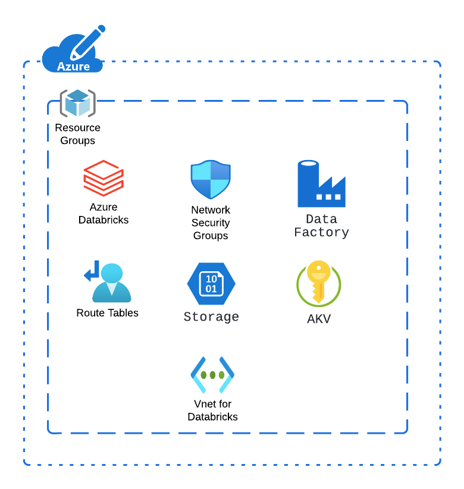

### MEN Lakehouse terraform blueprints
This module contains Terraform code used to provision a Lakehouse platform.

*** This module can be used to deploy the following: ***

Azure Lakehouse platform

A new resource group
Networking resources including:
Azure vnet
The required subnets for the Azure Databricks workspace.
Azure route table (if needed)
Network Security Group (NSG)
The Lakehouse platform resources, including:
Azure Databricks workspace
Azure Data Factory
Azure Key Vault
Azure Storage account
How to use
Note
You can customize this module by adding, deleting or updating the Azure resources to adapt the module to your requirements. A deployment example using this module can be found in examples/adb-lakehouse

Reference this module using one of the different module source types
Add a variables.tf with the same content in variables.tf
Add a terraform.tfvars file and provide values to each defined variable
Add a output.tf file.
(Optional) Configure your remote backend
Run terraform init to initialize terraform and get provider ready.
Run terraform apply to create the resources.
